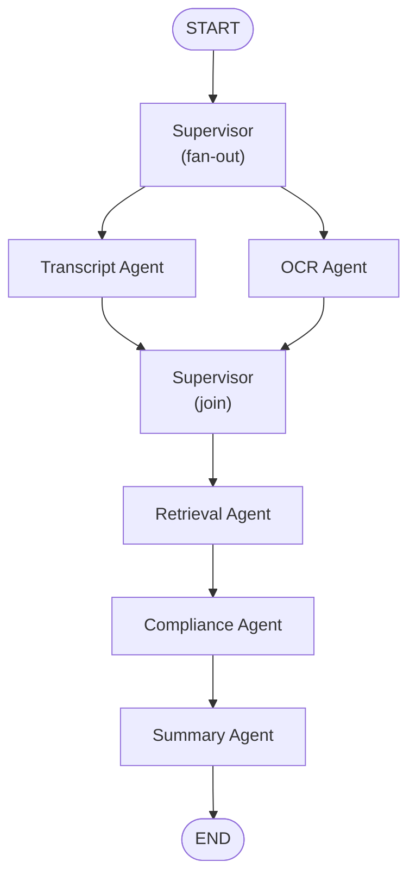

# AI_PIPELINE_VISION.md
## VidAuditFlow — LangGraph Pipeline v2

Design principle: **a supervisor and five fixed, statically-wired nodes — nothing dynamic, nothing agentic in the "tool-calling planner" sense.** This is deliberately a DAG with one coordinating node, not an autonomous multi-agent system with dynamic routing or tool discovery. That keeps it simple, debuggable, and fast, while still being meaningfully more capable and more legible than the current 2-function graph.

The "Supervisor" is a single Python function acting as a **router/aggregator**, not an LLM call — it fans out to Transcript + OCR (which can run concurrently since neither depends on the other), joins their results, and then hands off linearly to Retrieval → Compliance → Summary. This keeps latency down (transcript and OCR extraction happen in parallel instead of sequentially) without introducing any actual dynamic-planning complexity.

---

## Supervisor Node

- **Input:** initial state (`video_url`, `video_id`, `user_id`, `job_id`).
- **Output:** on fan-out, no state change (just triggers the two parallel branches); on join, a merged state containing both `transcript` and `ocr_text` (or partial-failure markers for either).
- **Responsibilities:** decide whether the pipeline can proceed after the join. If **both** Transcript and OCR failed, halt the graph and mark the job `failed`. If **one** succeeded, proceed with a `degraded_confidence` flag threaded through to the Compliance Agent's prompt (so the final report can honestly say "OCR was unavailable; this analysis is transcript-only"). If both succeeded, proceed normally.
- **Failure handling:** the Supervisor itself makes no external calls, so it cannot fail on I/O — its only failure mode is a logic bug, which is caught by the same test suite covering the rest of the graph (see `BACKEND_VISION.md` testing section).
- **Prompt strategy:** none — this node is pure Python control flow, not an LLM call. (Keeping the Supervisor non-LLM is a deliberate simplicity choice — it removes an entire class of "the router hallucinated a wrong decision" failure mode.)
- **Expected latency:** negligible (<50ms), since it's just state merging/branching logic.

---

## Transcript Agent

- **Input:** `video_url`, `video_id`.
- **Output:** `transcript: str`, `video_metadata: dict` (duration, resolution), `transcript_status: "success" | "failed"`.
- **Responsibilities:** download the video (via the `youtube.py` service, with URL-host validation and a duration/size cap — closing audit finding M8), upload to Azure Video Indexer, poll for completion (bounded polling with a max attempt count and overall timeout — closing audit finding C5), extract the transcript portion of the Video Indexer response.
- **Failure handling:** wraps all external calls (`yt-dlp`, Video Indexer REST calls) in the shared retry-with-backoff wrapper (max 2 retries, exponential backoff) from `services/`. On exhausted retries, returns `transcript_status: "failed"` with a captured error message in state rather than raising — the graph continues to the Supervisor's join step instead of crashing the whole run.
- **Prompt strategy:** none — this node does not call an LLM. It's pure ingestion/extraction.
- **Expected latency:** dominated by Azure Video Indexer processing time — realistically **1–5 minutes** depending on video length; this is the single longest step in the pipeline and is exactly why the UI's live-tracker design (see `UI_VISION.md`) treats this stage with an honest, explicit progress indicator rather than a generic spinner.

---

## OCR Agent

- **Input:** `video_url`, `video_id` (same inputs as Transcript Agent — see note below on shared indexing call).
- **Output:** `ocr_text: List[str]`, `ocr_status: "success" | "failed"`.
- **Responsibilities:** extract the on-screen-text (OCR) portion of the same Azure Video Indexer response used by the Transcript Agent.
- **Implementation note (important simplicity decision):** Azure Video Indexer returns transcript *and* OCR in a single indexing job/response. Rather than triggering two separate upload+poll cycles (wasteful and slower), the Transcript Agent performs the single upload+poll, and the OCR Agent's "extraction" step reads OCR fields from the *same* already-fetched Video Indexer payload (passed through shared state or a shared cache keyed by `video_id`). This keeps the two nodes conceptually separate (independently testable, independently retryable at the *extraction* level) without duplicating the expensive network operation. If a genuinely independent OCR-only reprocessing path is ever needed, it can call Video Indexer directly — but that's a Future-bucket concern, not a v2 requirement.
- **Failure handling:** if the shared Video Indexer payload itself failed to arrive (Transcript Agent's job failed entirely), OCR Agent immediately returns `ocr_status: "failed"` without attempting redundant work. If the payload arrived but the OCR insight section is empty/malformed, returns `ocr_status: "success"` with an empty list (a video with no on-screen text is a valid, common case — not a failure).
- **Prompt strategy:** none — pure extraction, no LLM call.
- **Expected latency:** near-zero once the Transcript Agent's Video Indexer call has returned (just parsing the already-fetched JSON) — the two nodes appear "parallel" in the graph topology and in intent, but in practice OCR extraction is nearly instant relative to the shared indexing wait.

---

## Retrieval Agent

- **Input:** `transcript`, `ocr_text`.
- **Output:** `retrieved_rules: List[RetrievedChunk]` where each chunk carries `page_content` **and** `metadata.source` (closing audit finding M12 — citations are now preserved through to the final report instead of being discarded).
- **Responsibilities:** build a retrieval query from transcript + OCR (for long transcripts, summarize/truncate to a bounded token budget before embedding — closing the audit's "unbounded prompt size" finding rather than concatenating the entire raw transcript), embed the query, run `similarity_search` against Azure AI Search, return the top-k chunks **with metadata intact**.
- **Failure handling:** retry-wrapped embedding/search calls (same shared policy as Transcript Agent). If retrieval ultimately fails, the node returns an empty rule set with `retrieval_status: "failed"` rather than raising — the Compliance Agent can still run a "general knowledge, no retrieved policy grounding" pass with an explicit disclaimer in the report, which is more honest and useful than failing the whole audit over a transient search-service blip.
- **Prompt strategy:** no generative prompt (embedding + vector search only), but a defined **query-construction strategy** replaces the current "just concatenate everything": prioritize transcript sentences containing claim-like language (superlatives, guarantees, health/financial claims) if the transcript exceeds the token budget, falling back to a simple truncation if no such heuristic match exists. This is a lightweight rule, not a separate LLM call — kept simple deliberately.
- **Expected latency:** 1–3 seconds (one embedding call + one vector search call).

---

## Compliance Agent

- **Input:** `transcript`, `ocr_text`, `retrieved_rules` (with citations), `video_metadata`, any `degraded_confidence`/`retrieval_status` flags from upstream.
- **Output:** `compliance_results: List[ComplianceIssue]` (each with `category`, `severity`, `description`, and now `source_citation`), `compliance_status: "PASS" | "FAIL"`.
- **Responsibilities:** the core judgment call — apply the retrieved rules to the transcript/OCR content and identify violations, using a Pydantic-structured-output call (`with_structured_output(ComplianceAnalysisResult)`) instead of raw `json.loads()` on fenced Markdown — closing audit finding M5 and its downstream fragile-regex-parsing sibling M6.
- **Failure handling:** structured-output parsing failure triggers **one** automatic re-prompt with the parser's error fed back to the model ("your last response didn't match the required schema because X — try again"), a standard and cheap LangChain pattern; if that also fails, the node returns `compliance_status: "FAIL"` with a system-generated issue explaining the analysis could not be completed, rather than surfacing a raw exception to the user.
- **Prompt strategy:** system prompt clearly separates (a) retrieved regulatory rules with their citations, (b) the video's transcript/OCR content, and (c) the strict output schema — same shape as today's prompt, upgraded with: an explicit instruction to cite which retrieved rule/source justifies each violation; an explicit instruction on how to behave if `retrieved_rules` is empty (state that no grounding was available rather than inventing a rule); and light **prompt-injection hardening** — the transcript/OCR block is wrapped in clear delimiters with an explicit system instruction that any instructions appearing inside the transcript/OCR content must be treated as untrusted video content, not as instructions to the model (closing the audit's prompt-injection finding).
- **Expected latency:** 3–8 seconds for a typical transcript length (one chat-completion call at `temperature=0`).

---

## Summary Agent

- **Input:** `compliance_results`, `compliance_status`, `video_metadata`.
- **Output:** `final_report: str` (a well-formatted, user-facing Markdown summary), `report_ready: true`.
- **Responsibilities:** a **separate, smaller LLM call** dedicated to turning structured violation data into a clear, well-written natural-language summary for the report UI — deliberately split out from the Compliance Agent so that "detecting violations" (a precision-critical task, kept at `temperature=0`) and "writing a readable summary" (a communication task, can tolerate a touch more `temperature`, e.g. `0.3`) are not forced through the same prompt with competing objectives. This split is also what makes the Summary Agent reusable later for the AI chat feature's initial "here's what we found" message.
- **Failure handling:** if the summary call fails, the node falls back to a deterministic, template-generated summary built directly from `compliance_results` (e.g., "2 critical and 1 warning violation were found: …") — the report is never blocked on this node succeeding, since the underlying structured data already exists.
- **Prompt strategy:** short, focused prompt: "Given these structured violations [...], write a 2–4 sentence executive summary a brand manager could read in 10 seconds, then a short bullet list of the top issues." No retrieval, no schema validation needed beyond plain text.
- **Expected latency:** 1–3 seconds.

---

## End-to-End Latency Budget (typical video)

| Stage | Typical latency |
|---|---|
| Supervisor (fan-out) | <50ms |
| Transcript Agent (download + Video Indexer processing) | 1–5 minutes (dominant cost) |
| OCR Agent (parses same payload) | <1s (parallel with/after Transcript) |
| Supervisor (join) | <50ms |
| Retrieval Agent | 1–3s |
| Compliance Agent | 3–8s |
| Summary Agent | 1–3s |
| **Total** | **~1–5 minutes, almost entirely Video Indexer processing time** |

This budget is the direct justification for the product decision in `BACKEND_VISION.md`/`API_PLAN.md` to make audit submission asynchronous (`202 Accepted` + polling) rather than a blocking request — the post-ingestion AI stages (Retrieval → Compliance → Summary) are fast; the Video Indexer wait is not, and no amount of backend optimization changes that, so the UX has to be designed around it honestly (see `UI_VISION.md`'s live-tracker section).

---

## Reliability Additions (all closing specific audit findings)

- **Checkpointing:** `workflow.compile(checkpointer=...)` using LangGraph's SQLite/Postgres checkpointer (backed by the same database as the rest of the app) — if the process restarts mid-run, the job can resume from its last completed node instead of restarting the multi-minute Transcript Agent from zero.
- **Per-node retry policy:** `RetryPolicy(max_attempts=3, backoff_factor=2)` attached to Transcript, OCR, Retrieval, and Compliance nodes (all nodes with external calls) — closes audit finding M7.
- **Structured-output validation:** Compliance Agent's output is a validated Pydantic model, not `json.loads()` on regex-stripped text — closes M5/M6.
- **Citations preserved end-to-end:** `metadata.source` flows from Retrieval Agent through Compliance Agent into the final `ComplianceIssue.source_citation` field, all the way to the UI's violation cards — closes M12.
- **Consistent embedding configuration:** the embedding deployment name is read once from `core/config.py` (no hardcoded string in the Retrieval Agent, no independent fallback in the ingestion script) — closes M2's index/query embedding-model drift risk.

## What this pipeline deliberately does **not** do

- No dynamic tool selection or LLM-driven routing between nodes — the graph topology is fixed and predictable.
- No agent-to-agent negotiation or multi-turn planning loops.
- No separate vector DB or self-hosted model — Azure AI Search and Azure OpenAI remain the only AI infrastructure.
- No more than 5 specialist nodes + 1 supervisor, by design — additional capability should extend an existing node's responsibility before adding a 7th node to the graph.
