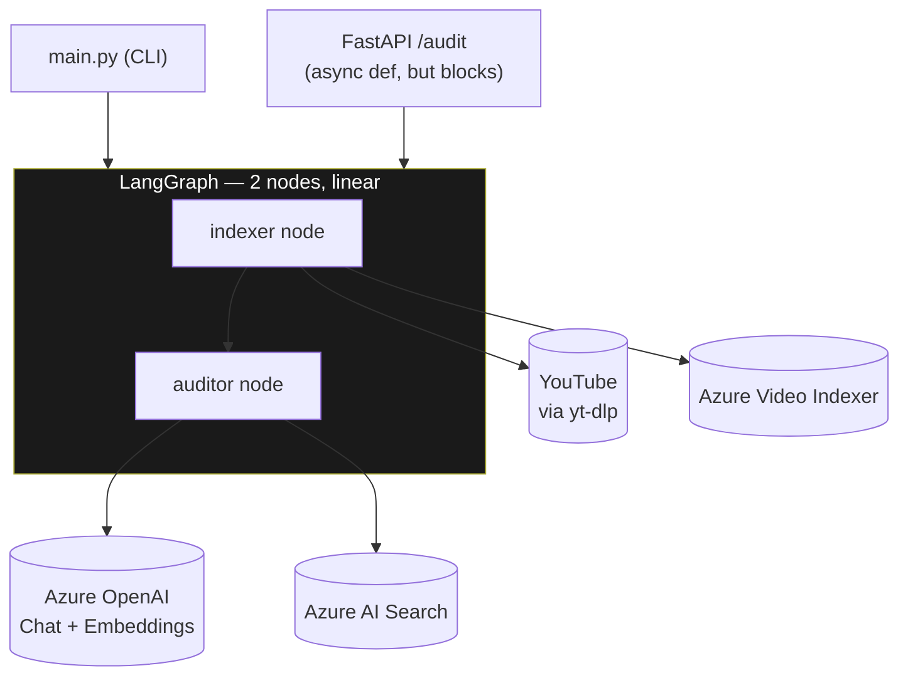
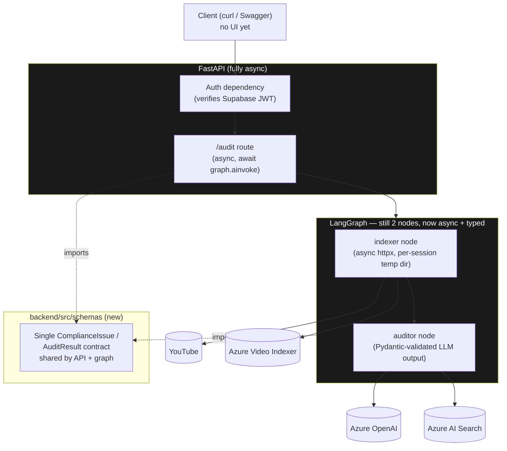
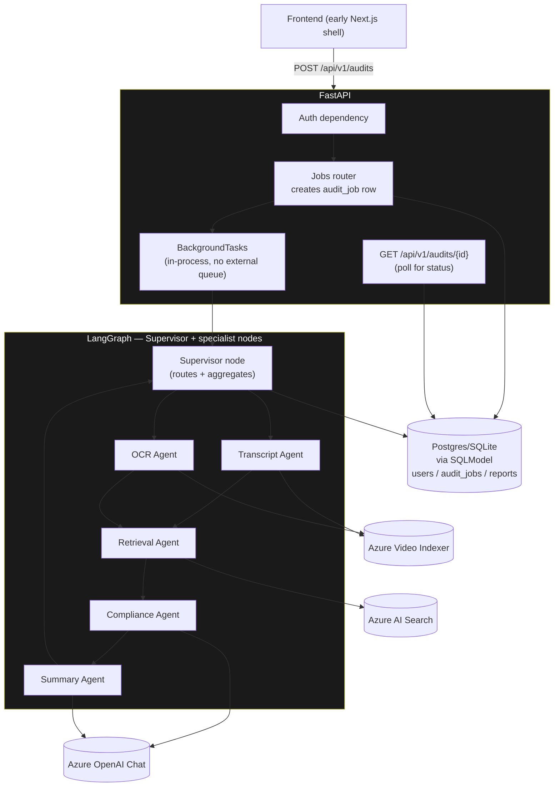
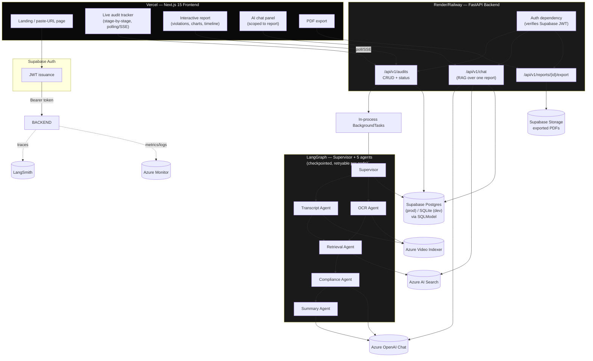

# ARCHITECTURE_EVOLUTION.md
## VidAuditFlow — Architecture Progression

This document shows the system's architecture at four points in time: **today**, and after **Phase 2**, **Phase 3**, and the **Final** target state. Each stage is additive — nothing from an earlier stage is thrown away, only extended. Detailed session-by-session sequencing lives in `IMPLEMENTATION_PHASES.md`; this document is the "shape of the system" view.

---

## Stage 0 — Current Architecture (as audited)

Single process, no persistence, no UI, no auth. See `PROJECT_AUDIT.md` for full findings.

**Characteristics:** synchronous end-to-end, no database, no accounts, in-memory state only, single hardcoded video path, no UI.

---

## Stage 1 — Phase 2: Foundation Hardening (async + schema + auth skeleton)

Goal: make the *existing* shape safe and typed before adding new capability. No new user-facing features yet — this stage is invisible to an end user but removes every Critical defect from the audit.

**What changed:** async everywhere, per-request temp file isolation, one shared Pydantic schema module, an auth dependency wired but not yet backed by a real signup UI, `.env` hygiene fixed, timeouts/retries added to all outbound HTTP calls.

---

## Stage 2 — Phase 3: Data Layer + AI Pipeline v2

Goal: introduce persistence and upgrade the AI pipeline from "2 functions" to a legible supervisor + specialist-agent graph, still fully synchronous-free of external infrastructure (no queues, no k8s).

**What changed:** `users`/`audit_jobs`/`reports` tables exist (SQLite locally); the 2-node graph becomes a supervisor with 5 specialist nodes (transcript + OCR now explicit and independently retryable, retrieval is its own node instead of 3 inline lines, summary is separated from compliance judgment); job creation returns immediately and the client polls status — no more request blocking on multi-minute Video Indexer processing.

---

## Stage 3 — Final Architecture (target)

Goal: the full product — real frontend, real auth, real storage, real exports, real observability.

**What changed from Stage 2:** full frontend experience, chat is its own RAG surface scoped to a completed report (reuses the Retrieval Agent's pattern, not a new pipeline), exports write to Supabase Storage instead of being generated on-the-fly only, and both LangSmith and Azure Monitor are load-bearing observability (not optional env-var-only integrations).

---

## What deliberately never appears in any stage

To keep this evolution honest about its own constraints:

- No Kubernetes / container orchestration at any stage.
- No message broker (Kafka/RabbitMQ/SQS) at any stage — `BackgroundTasks` inside the single FastAPI process is sufficient at this scale, since audits are seconds-to-minutes, not hours, and volume is portfolio-demo scale, not production-enterprise scale.
- No microservice split — "backend" is one deployable FastAPI app in every stage.
- No self-hosted vector DB or self-hosted LLM — Azure AI Search and Azure OpenAI remain external managed services throughout.
