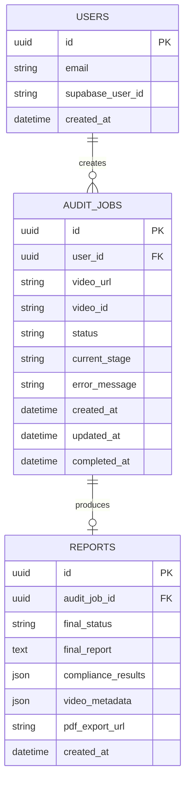

# DATABASE_PLAN.md
## VidAuditFlow — Minimal Database Design

Principle: **three tables, no more.** Every field earns its place by being read by a concrete feature in `FEATURE_ROADMAP.md`. SQLModel is the single schema definition, used both as the ORM model and (where shapes align) the API read-model.

- **Local dev:** SQLite file (`vidauditflow.db`), zero setup.
- **Production:** Supabase Postgres, same SQLModel code, connection string swapped via `DATABASE_URL`.
- **Migrations:** Alembic, initialized from day one even though the schema starts simple — retrofitting migrations onto a live database later is more painful than starting with them, and the setup cost is small.

---

## Entity-Relationship Overview



**Relationship notes:**
- `users` : `audit_jobs` is one-to-many — a user has many audits.
- `audit_jobs` : `reports` is one-to-zero-or-one — a job produces at most one report, and only once it reaches `completed` status. Keeping these as two tables (rather than one wide table) separates **operational state** (job status, current stage, error) from **result data** (the report content), which have different read/write patterns: the job row is written frequently during a run (status polling), the report row is written once at the end and read frequently thereafter (viewing history, chat, export).

---

## Table: `users`

Mirrors Supabase Auth's user identity into the app's own database so `audit_jobs`/`reports` can have a normal foreign key, without duplicating auth logic (Supabase remains the source of truth for credentials/sessions; this table is a lightweight local mirror created on first login).

| Column | Type | Constraints | Purpose |
|---|---|---|---|
| `id` | `UUID` | PK, default `gen_random_uuid()` | Internal app-level user id (used in FKs). |
| `supabase_user_id` | `str` | Unique, indexed, not null | The `sub` claim from the Supabase JWT — links this row to the Supabase Auth identity. |
| `email` | `str` | Not null | Denormalized from Supabase for convenience (display, quota lookups) — Supabase remains authoritative if it ever changes. |
| `created_at` | `datetime` | Not null, default now | Account creation timestamp. |

**SQLModel sketch (illustrative only — no code is being written in this planning phase):**
```python
class User(SQLModel, table=True):
    id: UUID = Field(default_factory=uuid4, primary_key=True)
    supabase_user_id: str = Field(unique=True, index=True)
    email: str
    created_at: datetime = Field(default_factory=datetime.utcnow)
```

**Why not store passwords/sessions here:** Supabase Auth already owns that responsibility correctly and securely; duplicating it would be exactly the kind of unnecessary complexity this plan avoids.

---

## Table: `audit_jobs`

The operational record of one audit run — created the instant a user submits a URL, updated throughout the LangGraph run, read constantly by the frontend's polling hook.

| Column | Type | Constraints | Purpose |
|---|---|---|---|
| `id` | `UUID` | PK | Job identifier, returned to the client on creation and used in all subsequent polling/status calls. |
| `user_id` | `UUID` | FK → `users.id`, indexed | Owner of this job — enforces per-user history and authorization checks. |
| `video_url` | `str` | Not null | The submitted YouTube URL. |
| `video_id` | `str` | Not null | Short internal identifier (mirrors today's `vid_xxxxxxxx` convention). |
| `status` | `str` (enum-like) | Not null, default `"queued"` | One of `queued`, `running`, `completed`, `failed`. |
| `current_stage` | `str`, nullable | | One of the six pipeline stage names (see `AI_PIPELINE_VISION.md`) — drives the live-tracker UI directly. |
| `error_message` | `str`, nullable | | Populated only if `status == "failed"`; the *safe*, user-facing message (never a raw exception string — see `BACKEND_VISION.md` error handling). |
| `created_at` | `datetime` | Not null | For history sorting. |
| `updated_at` | `datetime` | Not null | Bumped on every stage transition — lets the frontend detect staleness (e.g., "no update in 10 minutes" → show a stall warning). |
| `completed_at` | `datetime`, nullable | | Set when `status` reaches a terminal state; used for duration display ("completed in 2m14s"). |

**Indexes:** `(user_id, created_at DESC)` for the history list view; `(id)` PK for direct lookup.

**Why `current_stage` is a plain string, not a separate `stages` table:** there are exactly six fixed stages, known at design time (see `AI_PIPELINE_VISION.md`); a normalized stages table would be classic overengineering for a closed, small enum. If per-stage timing/history is ever needed beyond "what's the current stage," a lightweight `audit_job_events` append-only table is the natural Future extension — not needed for the MVP.

---

## Table: `reports`

The finished result of a completed audit job — the data the report UI, PDF export, and chat feature all read from.

| Column | Type | Constraints | Purpose |
|---|---|---|---|
| `id` | `UUID` | PK | Report identifier. |
| `audit_job_id` | `UUID` | FK → `audit_jobs.id`, unique, indexed | One report per job; unique constraint enforces the one-to-zero-or-one relationship. |
| `final_status` | `str` | Not null | `"PASS"` or `"FAIL"` — the headline verdict. |
| `final_report` | `text` | Not null | The Summary Agent's Markdown narrative. |
| `compliance_results` | `JSON` | Not null, default `[]` | List of `ComplianceIssue` objects (`category`, `severity`, `description`, `source_citation`, `timestamp`) — stored as JSON rather than a normalized child table because it's always read/written as a whole unit per report, never queried by individual violation across reports in this MVP. |
| `video_metadata` | `JSON`, nullable | | Duration, platform, resolution — whatever `Transcript Agent` returns. |
| `pdf_export_url` | `str`, nullable | | Populated once a PDF export has been generated and uploaded to Supabase Storage; `null` until first export, cached thereafter so repeat exports don't regenerate the file. |
| `created_at` | `datetime` | Not null | |

**Why `compliance_results` as JSON, not a normalized `violations` table:** the audit's own findings (audit finding M12 on citations, and the general shape of the data) show this is always consumed as "the list of violations for this one report," rendered together, never filtered/aggregated across reports in any planned feature (`FEATURE_ROADMAP.md` has no "search violations across all my reports" feature — and if that's ever wanted, it belongs in the Future bucket with its own normalized-table migration). Postgres and SQLite both support JSON columns natively via SQLModel/SQLAlchemy, so this isn't a portability compromise either.

---

## Migration Strategy

- **Tooling:** Alembic, configured against the same SQLModel metadata.
- **Initial migration:** creates all three tables as designed above.
- **Local dev:** SQLite migrations run automatically on app startup (`alembic upgrade head` as part of the dev bootstrap) for zero-friction local setup.
- **Production:** migrations run as an explicit deploy step (Render/Railway pre-deploy command or a manual `alembic upgrade head` before promoting a release) — never auto-run against production on every boot, to avoid a bad migration silently applying itself.
- **Schema evolution discipline:** any new column must be nullable or have a server-side default (avoids locking/breaking existing rows on Postgres); no destructive migrations (column drops/renames) without a documented backward-compatible rollout across two deploys, consistent with the rollback strategy in `IMPLEMENTATION_PHASES.md`.

## Data Retention (deliberately simple, day-one policy)

- No automatic deletion in the MVP — a portfolio demo benefits from history persisting, and volume is low enough that storage cost is negligible.
- `pdf_export_url` files in Supabase Storage are content-addressed by `report_id`, so re-triggering an export overwrites rather than accumulates duplicate files.
- A future "delete my account" flow (cascading delete of `audit_jobs`/`reports`) is a small, well-understood addition deferred to whenever real user data (not just the developer's own demo account) makes it necessary — not required for the MVP itself.
