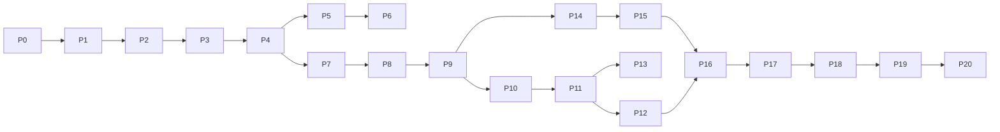

# IMPLEMENTATION_PHASES.md
## VidAuditFlow — Sequential Implementation Phases

Each phase is scoped to fit comfortably in **one Claude Code session**. Phases are ordered so every phase leaves the repo in a working, demoable state — nothing is ever mid-broken between sessions for more than the duration of that one session. This document is the execution companion to `MODERNIZATION_PLAN.md` (why) and `FEATURE_ROADMAP.md` (what).

---

### Phase 0 — Secrets & Repo Hygiene
- **Objectives:** close audit finding C2 before any other work touches the repo; make the repo safe to commit freely from this point forward.
- **Files affected:** `.gitignore`, `.env` → `.env.example`, new blank `.env` (git-ignored).
- **Expected output:** `.env` is git-ignored; `.env.example` documents every current variable with a blank value; first real `git init`/commit of the project can happen safely.
- **Risk level:** Very Low.
- **Rollback strategy:** trivial — single-file edits, revert via `git checkout` if needed (though at this point there's nothing to roll back to, since this is pre-first-commit).
- **Validation checklist:**
  - [ ] `git status` no longer shows `.env` as trackable once `.gitignore` is updated and `.env` is removed from the index if previously added.
  - [ ] `.env.example` contains every variable referenced anywhere in the codebase.

---

### Phase 1 — Async Backend Core (close C1, C3, M1, M3)
- **Objectives:** make the existing 2-node pipeline fully async and concurrency-safe without changing its external behavior.
- **Files affected:** `backend/src/api/server.py`, `backend/src/graph/nodes.py`, `backend/src/services/video_indexer.py`.
- **Expected output:** `await compliance_graph.ainvoke(...)` replaces the blocking `.invoke()` call; `VideoIndexerService` uses `httpx.AsyncClient` with explicit timeouts on every call; the fixed `temp_audit_video.mp4` filename is replaced with a per-job temp path (e.g., `tempfile.mkdtemp()` keyed by `video_id`).
- **Risk level:** Medium — touches the core execution path; must be verified against the existing CLI (`main.py`) and API path both still working end-to-end.
- **Rollback strategy:** these changes are isolated to 3 files with no schema/contract changes; revert via git if the async conversion introduces a regression, since the sync version remains functionally equivalent.
- **Validation checklist:**
  - [ ] Two concurrent `POST /audit` requests (or the CLI + API run simultaneously) no longer collide on the temp file.
  - [ ] `/health` responds instantly even while an audit is mid-run (proves the event loop is no longer blocked).
  - [ ] Every `requests`/`httpx` call has an explicit timeout.

---

### Phase 2 — Shared Schema Consolidation (close M4)
- **Objectives:** create a single `schemas/` module for `ComplianceIssue`/`AuditResult`, imported by both the graph and the API, removing the duplicated `TypedDict`/`BaseModel` definitions.
- **Files affected:** new `backend/src/schemas/audit.py`; edits to `backend/src/graph/state.py`, `backend/src/api/server.py`.
- **Expected output:** one `ComplianceIssue` Pydantic model used everywhere; `VideoAuditState` imports it rather than redefining it.
- **Risk level:** Low–Medium — a pure refactor with no new behavior, but touches type contracts used across the graph.
- **Rollback strategy:** git revert; no data/schema migration involved since there's no database yet at this phase.
- **Validation checklist:**
  - [ ] `grep` confirms `ComplianceIssue` is defined exactly once in the codebase.
  - [ ] Existing CLI/API smoke test still produces an identical response shape.

---

### Phase 3 — Structured LLM Output + URL Validation (close M5, M6, security SSRF finding)
- **Objectives:** replace raw `json.loads()`/regex fence-stripping with `with_structured_output()` against the Phase 2 schema; replace the substring YouTube-URL check with real URL parsing + host allow-list.
- **Files affected:** `backend/src/graph/nodes.py`, new `backend/src/schemas/audit.py` additions, `backend/src/services/youtube.py` (new, extracted from `video_indexer.py`).
- **Expected output:** malformed LLM responses trigger one automatic re-prompt instead of an unhandled `AttributeError`; non-YouTube/malicious URLs are rejected at validation time with a clear `400`, before reaching `yt-dlp`.
- **Risk level:** Medium — changes the LLM call's output-handling path, the most failure-sensitive part of the pipeline.
- **Rollback strategy:** keep the old parsing path available behind a feature flag/env var for one phase if needed; otherwise straightforward git revert.
- **Validation checklist:**
  - [ ] Feeding a deliberately malformed mock LLM response in a test exercises the re-prompt path without crashing.
  - [ ] A crafted URL like `https://evil.com/?x=youtube.com` is rejected with `400`, not passed to `yt-dlp`.

---

### Phase 4 — Central Configuration & Logging (close M2, L1, L2, config inconsistencies)
- **Objectives:** introduce `core/config.py` (Pydantic `BaseSettings`) as the only place env vars are read; introduce `core/logging.py` as the only place logging is configured.
- **Files affected:** new `backend/src/core/config.py`, `backend/src/core/logging.py`; edits to every file currently calling `os.getenv`/`logging.basicConfig` directly (`main.py`, `server.py`, `nodes.py`, `telemetry.py`, `video_indexer.py`, `index_documents.py`).
- **Expected output:** single source of truth for configuration; consistent structured logging across the app; embedding deployment name no longer hardcoded in `nodes.py`.
- **Risk level:** Medium — touches many files, but each change is mechanical (replace `os.getenv("X")` with `settings.x`).
- **Rollback strategy:** git revert; low functional risk since behavior should be identical, only the access pattern changes.
- **Validation checklist:**
  - [ ] `grep -r "os.getenv"` outside `core/config.py` returns nothing.
  - [ ] App fails fast at startup with a clear message if a required setting is missing (test by unsetting one required var locally).

---

### Phase 5 — Test Suite Foundation (close C6)
- **Objectives:** stand up `pytest`, write the first real unit tests (mocked Azure clients) for the graph nodes and services, and integration tests (`TestClient`) for the existing routes.
- **Files affected:** `backend/tests/unit/*`, `backend/tests/integration/*`, `backend/pyproject.toml` (add `pytest`, `pytest-asyncio`, `httpx` test deps).
- **Expected output:** a runnable `pytest` suite covering the current (Phase 0–4-hardened) backend at a meaningful baseline — not exhaustive, but real.
- **Risk level:** Low — purely additive.
- **Rollback strategy:** N/A (additive only).
- **Validation checklist:**
  - [ ] `uv run pytest` passes locally.
  - [ ] At least one test per graph node, per service method, and per API route exists.

---

### Phase 6 — CI Pipeline
- **Objectives:** GitHub Actions workflow running lint + `pytest` on every push/PR touching `backend/`.
- **Files affected:** new `.github/workflows/backend-ci.yml`.
- **Expected output:** PRs show a pass/fail check; merges to `main` are gated on green CI.
- **Risk level:** Low.
- **Rollback strategy:** disable/delete the workflow file if it's misconfigured; no impact on runtime code.
- **Validation checklist:**
  - [ ] A deliberately broken test fails the CI run on a test branch.
  - [ ] A clean branch passes.

---

### Phase 7 — Database Layer (SQLModel + SQLite)
- **Objectives:** implement the three tables from `DATABASE_PLAN.md` against local SQLite; wire Alembic for migrations.
- **Files affected:** new `backend/src/db/models.py`, `backend/src/db/session.py`, `backend/alembic/`.
- **Expected output:** `users`, `audit_jobs`, `reports` tables exist locally; a manual smoke script can create a job row and a report row.
- **Risk level:** Medium — first real persistence layer; migration tooling setup can be fiddly.
- **Rollback strategy:** SQLite file is disposable in dev; delete and re-run `alembic upgrade head` if a migration goes wrong.
- **Validation checklist:**
  - [ ] `alembic upgrade head` creates all three tables with the documented columns.
  - [ ] A unit test can create/read/update rows via SQLModel sessions.

---

### Phase 8 — Auth Skeleton (Supabase JWT verification)
- **Objectives:** implement `core/security.py`'s JWT verification and `api/deps.py`'s `get_current_user`, backed by a real (free-tier) Supabase project; auto-create a local `users` row on first-seen token.
- **Files affected:** new `backend/src/core/security.py`; edits to `backend/src/api/deps.py`.
- **Expected output:** a protected test route returns `401` without a token and `200` with a valid Supabase-issued token.
- **Risk level:** Medium — first external identity-provider integration.
- **Rollback strategy:** keep the route unprotected behind a settings flag until this phase is validated end-to-end, then flip it on.
- **Validation checklist:**
  - [ ] A token obtained by logging into the (not-yet-built) frontend's Supabase project successfully authenticates against the backend.
  - [ ] An expired/tampered token is rejected with `401`.

---

### Phase 9 — Jobs Router + Background Execution (the async-job product shape)
- **Objectives:** implement `POST /api/v1/audits`, `GET /api/v1/audits`, `GET /api/v1/audits/{id}` per `API_PLAN.md`, backed by `jobs/audit_runner.py` running the existing (still 2-node, for now) graph via `BackgroundTasks`.
- **Files affected:** new `backend/src/api/routers/audits.py`, `backend/src/jobs/audit_runner.py`; retirement of the old `/audit` route.
- **Expected output:** submitting a URL returns `202` immediately with a job id; polling the job id shows status progressing to `completed`/`failed`; a `reports` row is created on completion.
- **Risk level:** Medium–High — this is the biggest single behavioral change so far (sync request/response → async job model).
- **Rollback strategy:** keep the old synchronous `/audit` route available at a legacy path during this phase's validation window; remove it only once the new job-based flow is confirmed working end-to-end.
- **Validation checklist:**
  - [ ] Full loop verified: create job → poll status → see `completed` → fetch report → data matches what the old synchronous route used to return.
  - [ ] A deliberately failing video URL produces a `failed` job with a safe `error_message`, not a crash.

---

### Phase 10 — LangGraph v2: Supervisor + Transcript/OCR Split
- **Objectives:** restructure the graph per `AI_PIPELINE_VISION.md` — introduce the Supervisor node and split the current `index_video_node` into Transcript Agent + OCR Agent sharing one Video Indexer payload.
- **Files affected:** new `backend/src/graph/supervisor.py`, `backend/src/graph/nodes/transcript_agent.py`, `backend/src/graph/nodes/ocr_agent.py`; edits to `backend/src/graph/workflow.py`, `backend/src/graph/state.py`.
- **Expected output:** graph topology matches the Stage-2 diagram in `ARCHITECTURE_EVOLUTION.md`; a partial failure (e.g., OCR extraction fails) no longer fails the whole run.
- **Risk level:** High — the most significant AI-pipeline restructuring in the whole plan.
- **Rollback strategy:** land behind a `GRAPH_VERSION` setting if needed so the old 2-node graph remains callable while the new one is validated; remove the flag once confident.
- **Validation checklist:**
  - [ ] Existing test suite (Phase 5) extended with new node-level tests, all passing.
  - [ ] A run with a video that has no on-screen text still completes successfully with `ocr_text: []`.

---

### Phase 11 — LangGraph v2: Retrieval/Compliance/Summary Split + Checkpointing
- **Objectives:** extract Retrieval Agent, Compliance Agent, Summary Agent as distinct nodes with citations preserved (M12), retry policies attached (M7), and a checkpointer configured.
- **Files affected:** new `backend/src/graph/nodes/retrieval_agent.py`, `compliance_agent.py`, `summary_agent.py`; edits to `workflow.py`.
- **Expected output:** the final report includes `source_citation` per violation; a transient Azure error on one node auto-retries instead of failing the run; a killed/restarted process can resume a checkpointed run.
- **Risk level:** High — completes the pipeline restructuring; correctness of compliance judgments must be spot-checked against the old behavior.
- **Rollback strategy:** same `GRAPH_VERSION` flag approach as Phase 10; keep the eval fixtures (Phase 13) as the objective go/no-go signal before removing the old path.
- **Validation checklist:**
  - [ ] A known violating transcript (from the eval set, once Phase 13 lands, or a manual fixture beforehand) still produces a `FAIL` verdict with correct citations.
  - [ ] Killing the process mid-run and restarting resumes from the last completed node (verified against the checkpointer's stored state).

---

### Phase 12 — Backend Deployment (Render/Railway)
- **Objectives:** populate `backend/Dockerfile` for real; configure Render or Railway service pointing at `backend/`; wire production env vars (Supabase Postgres URL, Azure creds) as platform secrets.
- **Files affected:** `backend/Dockerfile`, new platform config (`render.yaml` or Railway equivalent).
- **Expected output:** a live, publicly reachable backend URL serving `/health` and the `/api/v1/*` routes against Supabase Postgres.
- **Risk level:** Medium — first production deployment; DNS/env misconfiguration is the likely failure mode, not code logic.
- **Rollback strategy:** platform-native rollback to the previous deploy (both Render and Railway support one-click rollback to a prior successful deploy).
- **Validation checklist:**
  - [ ] `GET /health` on the public URL returns `200`.
  - [ ] A full audit job runs successfully against production Supabase Postgres, not just local SQLite.

---

### Phase 13 — RAG Eval Set (small, fixed golden set)
- **Objectives:** create ~10–15 (transcript, expected verdict) fixtures covering clear-violation, clean, and edge cases (empty OCR, very long transcript); a script that runs them against the live graph and reports pass/fail.
- **Files affected:** new `backend/tests/eval/fixtures/*`, `backend/tests/eval/run_eval.py`.
- **Expected output:** a repeatable way to catch prompt/retrieval regressions before they reach users.
- **Risk level:** Low.
- **Rollback strategy:** N/A (additive, non-blocking by default; can be wired into CI as a non-gating informational job).
- **Validation checklist:**
  - [ ] Eval script runs end-to-end and produces a clear pass/fail summary per fixture.

---

### Phase 14 — Frontend Bootstrap + Auth
- **Objectives:** scaffold the Next.js 15 app per `FOLDER_STRUCTURE_V2.md`; wire Supabase Auth (login/signup pages, session middleware); connect `lib/api-client.ts` to the deployed backend.
- **Files affected:** entire new `frontend/` directory (initial scaffold).
- **Expected output:** a user can sign up, log in, and land on an empty dashboard shell that successfully calls the authenticated backend (e.g., `GET /api/v1/audits` returning an empty list).
- **Risk level:** Medium — first frontend code in the project; auth wiring is the main risk surface.
- **Rollback strategy:** frontend is a fresh directory with no prior state to protect; iterate freely, redeploy previews per PR via Vercel.
- **Validation checklist:**
  - [ ] Signup → login → dashboard loop works against the real Supabase project.
  - [ ] An authenticated API call from the frontend succeeds; an unauthenticated one is correctly redirected to login.

---

### Phase 15 — Landing Page + New-Audit Flow
- **Objectives:** build the marketing landing page and the paste-URL kickoff form, per `UI_VISION.md`.
- **Files affected:** `frontend/app/(marketing)/page.tsx`, `frontend/app/(dashboard)/audits/new/page.tsx`, related `components/`.
- **Expected output:** submitting a URL from the UI creates a real job via `POST /api/v1/audits` and redirects to the tracker page.
- **Risk level:** Low–Medium.
- **Rollback strategy:** Vercel preview deployments per PR; revert the PR if needed.
- **Validation checklist:**
  - [ ] Submitting a real YouTube URL from the browser results in a visible job id and redirect.
  - [ ] Invalid URLs show an inline validation error before submission.

---

### Phase 16 — Live Tracker + Report View
- **Objectives:** build the signature stage-tracker screen (polling `GET /api/v1/audits/{id}`) and the interactive report page (violations, charts, timeline) per `UI_VISION.md`.
- **Files affected:** `frontend/app/(dashboard)/audits/[id]/page.tsx`, `components/audit/*`, `components/charts/*`.
- **Expected output:** a full, working, good-looking end-to-end demo loop: paste URL → watch it audit → see the report.
- **Risk level:** Medium.
- **Rollback strategy:** Vercel previews; revert PR.
- **Validation checklist:**
  - [ ] A real audit run visibly progresses through all six stages in the UI.
  - [ ] The finished report correctly renders violations with severity, citations, and the AI summary.
  - [ ] Recharts visuals render correctly themed for dark mode (no default-white-tooltip regression).

---

### Phase 17 — AI Chat Panel
- **Objectives:** implement `POST /api/v1/reports/{id}/chat` on the backend and the chat UI panel on the frontend.
- **Files affected:** new `backend/src/api/routers/chat.py`; `frontend/components/chat/*`, `frontend/app/(dashboard)/audits/[id]/chat/page.tsx` (or an in-page panel).
- **Expected output:** a user can ask a follow-up question about a finished report and get a grounded, cited answer.
- **Risk level:** Medium.
- **Rollback strategy:** feature-flag the chat panel's visibility if the backend route isn't ready; ship UI and API together once both are validated.
- **Validation checklist:**
  - [ ] A question about a specific violation returns an answer citing the correct source.
  - [ ] An empty/garbage message is rejected with a clear inline error, not a broken request.

---

### Phase 18 — PDF Export
- **Objectives:** implement `POST /api/v1/reports/{id}/export`, Supabase Storage upload, and the frontend's "Export PDF" button.
- **Files affected:** new `backend/src/services/pdf_export.py`, `backend/src/services/storage.py`, edits to `backend/src/api/routers/reports.py`; frontend export button/download flow.
- **Expected output:** clicking "Export" produces a downloadable, well-formatted PDF matching the on-screen report.
- **Risk level:** Low–Medium.
- **Rollback strategy:** straightforward — isolated new feature, no impact on existing flows if reverted.
- **Validation checklist:**
  - [ ] Exported PDF opens correctly and contains all violations, the summary, and citations.
  - [ ] Re-exporting the same report reuses the cached `pdf_export_url` instead of regenerating.

---

### Phase 19 — Polish Pass (animations, empty/error states, responsive QA)
- **Objectives:** implement the Framer Motion signature moments from `UI_VISION.md` (stage-tracker transitions, report reveal, chat streaming, gauge animation); audit every screen for empty/loading/error states; responsive pass across breakpoints.
- **Files affected:** broad, shallow edits across `frontend/components/` and `frontend/app/`.
- **Expected output:** the product feels finished, not just functional.
- **Risk level:** Low (visual-only changes, low logic risk) but broad in surface area.
- **Rollback strategy:** Vercel previews per PR; can be done incrementally, screen by screen.
- **Validation checklist:**
  - [ ] Every async UI state (loading/empty/error) has a designed treatment, not a blank screen.
  - [ ] Mobile (375px), tablet (768px), and desktop (1440px) all reviewed manually.
  - [ ] `prefers-reduced-motion` respected.

---

### Phase 20 — README, Frontend CI, Final Deployment Wiring
- **Objectives:** write the real `README.md` (setup, env vars, run/deploy instructions); add `.github/workflows/frontend-ci.yml` (lint/typecheck/build); confirm Vercel production deploy from `main` and Render/Railway production deploy are both green.
- **Files affected:** `README.md`, `.github/workflows/frontend-ci.yml`, Vercel/Render project settings.
- **Expected output:** a stranger can clone the repo and, following the README alone, run the full stack locally and understand how it's deployed.
- **Risk level:** Low.
- **Rollback strategy:** N/A (documentation + CI config, no runtime risk).
- **Validation checklist:**
  - [ ] A fresh clone + README instructions successfully boots both apps locally.
  - [ ] Both CI workflows are green on `main`.
  - [ ] Both production URLs (Vercel frontend, Render/Railway backend) are live and linked from the README.

---

## Phase Dependency Summary

No phase after P9 requires all prior AI-pipeline work (P10/P11) to be complete before frontend work (P14+) can start against the *existing* job-based API — the two tracks (AI pipeline depth, frontend build-out) can proceed in parallel across separate sessions once the Phase 9 job-based API contract is stable, which is why `MODERNIZATION_PLAN.md`'s timeline treats "AI pipeline v2" and "Frontend v1" as parallel-capable tracks rather than strictly sequential.
