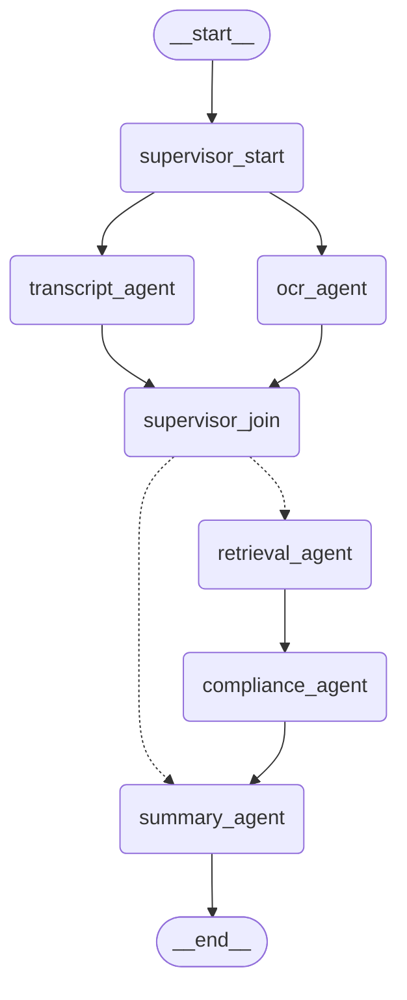

# PHASE_3_SUMMARY.md
## VidAuditFlow — Supervisor-Based AI Pipeline (Implementation Phase 2)

**Scope:** the LangGraph AI pipeline only, per AI_PIPELINE_VISION.md. No database, no auth, no frontend, no caching/queues/workers were introduced. The external `/audit` and `/health` API contracts and the CLI's user-visible behavior are unchanged.

---

## Architecture Before

Two nodes, linear, no orchestration layer:

```
START -> index_video_node -> audit_content_node -> END
```

- `index_video_node` did download + upload + poll + transcript/OCR extraction all in one function.
- `audit_content_node` did embedding + vector retrieval + LLM reasoning + manual `json.loads()`/regex Markdown-fence stripping all in one function.
- State was a `TypedDict` (`VideoAuditState`).
- No per-node tracing, no structured-output validation, no retry-on-malformed-output, no citation preservation, no degraded-mode handling — a failure anywhere produced a blanket `FAIL` with a generic message.

## Architecture After

A pure-Python Supervisor fans out to two concurrent specialist agents, joins them, then routes linearly through three more specialists:

```
START
  |
  v
supervisor_start (fan-out, no LLM)
  |         |
  v         v
transcript_agent   ocr_agent      <- run concurrently, share one Azure fetch
  |         |
  v         v
supervisor_join (no LLM)
  |
  +-- transcript failed -----------------------> summary_agent
  |
  v transcript succeeded
retrieval_agent
  |
  v
compliance_agent (structured output, retry-once)
  |
  v
summary_agent (deterministic score/risk/fixes + one small LLM call)
  |
  v
 END
```

State is now a strongly typed Pydantic `BaseModel` (`VideoAuditState`), validated at every node boundary.

## Graph Diagram (actual, exported from the compiled graph)



(Dotted edges are the conditional-routing branch out of `supervisor_join`.) This was generated by `graph_app.get_graph().draw_mermaid()` against the actual compiled workflow, not hand-drawn — confirming the real topology matches the design.

---

## Nodes Added

| Node | File | LLM call? | Responsibility |
|---|---|---|---|
| `supervisor_start` | `graph/supervisor.py` | No | Marks the job running; fan-out point |
| `transcript_agent` | `graph/nodes/transcript_agent.py` | No | Download + upload + poll (shared fetch) + transcript extraction |
| `ocr_agent` | `graph/nodes/ocr_agent.py` | No | OCR extraction from the *same* shared fetch, no duplicate Azure call |
| `supervisor_join` | `graph/supervisor.py` | No | Inspects both branches' outcomes; flags `ocr_unavailable` |
| `retrieval_agent` | `graph/nodes/retrieval_agent.py` | No (embeddings only) | Vector search against Azure AI Search; preserves citations |
| `compliance_agent` | `graph/nodes/compliance_agent.py` | Yes (structured output) | Reasoning only; validated `ComplianceAnalysis` output, retry-once |
| `summary_agent` | `graph/nodes/summary_agent.py` | Yes (one small call, with fallback) | Score/risk/fixes (deterministic) + executive summary (LLM) |

Plus one routing function (not a node): `supervisor.route_after_join`, a standard `add_conditional_edges` callable.

---

## Files Changed

### New
- `backend/src/graph/observability.py` — `StageTrace` model + `start_timer()`/`make_trace()`/`extract_token_usage()` helpers, used by every node.
- `backend/src/graph/coordination.py` — `SingleFlightGroup`, the per-job request-coalescing primitive that lets Transcript Agent and OCR Agent run as true concurrent branches without duplicating the Azure Video Indexer fetch.
- `backend/src/graph/prompts.py` — modular prompt templates (`COMPLIANCE_SYSTEM_PROMPT`/`build_compliance_context`, `SUMMARY_SYSTEM_PROMPT`/`build_summary_context`), replacing the old giant f-strings.
- `backend/src/graph/supervisor.py` — `supervisor_start`, `supervisor_join`, `route_after_join`.
- `backend/src/graph/adapters.py` — `to_audit_result()` / `resolve_external_status()`, the single place the graph's rich internal state is mapped down to the unchanged external contract.
- `backend/src/graph/nodes/` (package) — `transcript_agent.py`, `ocr_agent.py`, `retrieval_agent.py`, `compliance_agent.py`, `summary_agent.py`.

### Rewritten
- `backend/src/graph/state.py` — `TypedDict` → Pydantic `BaseModel`; new fields (`transcript_status`, `ocr_status`, `retrieval_status`, `compliance_status`, `retrieved_rules`, `violations`, `summary`, `confidence_score`, `risk_level`, `job_status`, `warnings`, `processing_metadata`); dropped `local_file_path` (no longer needed as shared state).
- `backend/src/graph/workflow.py` — new topology (see diagram above).
- `backend/src/schemas/audit.py` — `ComplianceIssue` extended additively (`confidence`, `evidence`, `policy_reference`, `recommendation`); new `ComplianceAnalysis` (internal structured-output contract) and `RetrievedRule`; new type aliases (`Severity`, `JobStatus`, `StageStatus`, `IngestStatus`).
- `backend/src/services/video_indexer.py` — `extract_data()` (bundled) replaced by `fetch_insights()` + three focused extractors (`extract_transcript`, `extract_ocr`, `extract_video_metadata`).
- `backend/src/api/main.py` — `/audit` now builds its response via `graph.adapters.to_audit_result()`; `ainvoke()` calls now pass a `config` with `run_name`/`tags`/`metadata` for LangSmith.
- `main.py` (CLI) — updated to the same adapter-based mapping; violation printing switched from dict `.get()` to attribute access (violations are now real `ComplianceIssue` model instances, not dicts — see Known Limitations).

### Removed
- `backend/src/graph/nodes.py` (the old flat 2-function module) — fully replaced by `graph/nodes/`.

### Bug fix (found during this phase's verification, not a planned deliverable)
- `backend/src/core/logging.py` — the `_JsonFormatter` was silently dropping every `extra={...}` field passed to a logging call; every `logger.info(msg, extra={"video_id": ...})` call since Phase 2 produced no visible metadata at all. Fixed to include any non-standard `LogRecord` attribute in the JSON payload. This was found while verifying this phase's new per-node observability logging and directly affects section 11's requirements, so it was fixed in place rather than left for a future phase.

---

## Prompt Improvements

- **Static instructions separated from per-call context.** `COMPLIANCE_SYSTEM_PROMPT`/`SUMMARY_SYSTEM_PROMPT` are fixed constants; `build_compliance_context()`/`build_summary_context()` format only the data that changes per run.
- **No more JSON-schema prose in the prompt.** Since both LLM calls now use `with_structured_output()`, the prompt no longer needs to describe `{"compliance_results": [...], "status": ..., "final_report": ...}` in text — LangChain binds the Pydantic schema directly via function-calling. This alone removed roughly a third of the old prompt's length.
- **Retrieved policy text and transcript/OCR are in clearly delimited Markdown sections** (`## Retrieved Policies`, `## Transcript`, `## On-Screen Text (OCR)`) instead of one interpolated blob.
- **Explicit instruction for the empty-retrieval case**: the Compliance Agent is told exactly how to behave if no policies were retrieved (use general judgment, say so, don't invent a citation) rather than silently guessing.
- **Citations are a first-class instruction**, not an afterthought: the prompt explicitly tells the model to cite `policy_reference` only when a provided policy clearly applies, and to leave it unset otherwise rather than inventing one.
- **The Summary Agent's narrative prompt is deliberately separate from the Compliance Agent's reasoning prompt**, each with a different `temperature` (0.0 for judgment, 0.3 for narrative writing) — the two tasks have different failure tolerances and shouldn't share one prompt's constraints.

---

## Performance Impact

- **Transcript and OCR extraction genuinely run concurrently.** Verified live: both nodes' "started" log lines appear within ~1ms of each other; a feasibility test with two 1-second async node sleeps completed the whole graph in ~1.02s (not ~2s), confirming LangGraph's Pregel executor runs same-superstep async nodes concurrently under `ainvoke()` with no manual `asyncio.gather()` needed at the graph level.
- **No duplicate Azure Video Indexer calls.** Verified live against a real YouTube URL: `"Downloading YouTube video"` and `"Download complete"` each appear exactly once in the logs, even though both `transcript_agent` and `ocr_agent` call into the shared fetch. `graph/coordination.py`'s `SingleFlightGroup` was also verified in isolation (2 concurrent callers -> exactly 1 factory execution -> clean state teardown -> independent jobs never collide).
- **The pipeline's latency is still dominated by Azure Video Indexer's own processing time** (unchanged, external, minutes-scale) — the new node structure does not add meaningful overhead on top of that; the added nodes (`supervisor_start`, `supervisor_join`, `retrieval_agent`) are each sub-second in the mocked end-to-end test (`processing_metadata` durations were ~0.0s for everything except the LLM calls).
- **One additional LLM call was introduced** (the Summary Agent's narrative paragraph) compared to Phase 2's single compliance call. This is deliberately small and has a zero-latency-risk fallback (a deterministic template) if it fails or is skipped, so it does not materially change the pipeline's worst-case latency, only its typical-case token cost.
- **Compliance Agent can now make up to 2 LLM calls** (original + one retry) instead of always exactly 1, only when the model's structured output fails validation. Verified in a mocked test: a deliberately malformed first response correctly triggered exactly one retry, which then succeeded.

---

## Failure Handling Improvements

| Scenario | Phase 2 behavior | Phase 3 behavior |
|---|---|---|
| Transcript extraction fails | Whole audit returns generic `FAIL` | `transcript_status="failed"` -> Supervisor routes straight to Summary Agent, which renders the same clear message, skipping Retrieval/Compliance entirely (no wasted work) |
| OCR extraction fails | Not distinguished from a transcript failure; OCR was extracted as part of the same call as transcript, so a failure there also zeroed out the transcript | Isolated: `ocr_status="failed"`, `ocr_text=[]`, a `warnings: ["ocr_unavailable"]` entry, and the audit **continues** with the transcript alone. `job_status` becomes `completed_degraded`. |
| Retrieval (vector search) fails | Whole audit returns generic `FAIL` | `retrieval_status="failed"`, empty `retrieved_rules`, a warning appended; Compliance Agent proceeds using general judgment (explicitly instructed how to do so honestly) instead of failing the audit |
| LLM returns malformed structured output | Regex fence-stripping could raise `AttributeError`; manual `json.loads()` could raise `JSONDecodeError`; both caught by one broad `except Exception` with no retry | Detected deterministically via `with_structured_output(..., include_raw=True)`'s `parsing_error` field (a `pydantic.ValidationError`, confirmed by a targeted test); retried once with the validation error fed back to the model; only degrades (with a `compliance_analysis_unavailable` warning) if the retry *also* fails |
| Compliance LLM call fails outright (network/auth/rate limit) | Same generic `FAIL` path as any other failure | Same graceful-degradation treatment as a retrieval failure — the audit still completes with a clear "manual review recommended" report rather than a bare failure |
| Citations from retrieved policy chunks | Fetched (`doc.metadata["source"]`) and then silently discarded before reaching the prompt or the report | Preserved end-to-end: `RetrievedRule.source` -> prompt's `[Source: ...]` tags -> `ComplianceIssue.policy_reference` -> rendered in the final report |

All of the above were exercised directly: the transcript-failure path against both a non-YouTube URL and a real YouTube URL (with intentionally blank Azure credentials in this environment), and the retrieval/compliance degradation and retry-once paths against a fully mocked graph run (no real Azure/OpenAI access available in this environment).

---

## Observability Improvements

- Every node now returns a `StageTrace` (`node`, `status`, `started_at`, `ended_at`, `duration_seconds`, `error`, `tokens_used`) appended to `state.processing_metadata` — verified present and correctly populated (including `tokens_used=300` for the Compliance Agent's two calls and `tokens_used=42` for the Summary Agent's narrative call in the mocked end-to-end test).
- `AzureChatOpenAI`/token usage is extracted via `extract_token_usage()`, a best-effort helper that never raises if usage metadata is unavailable from a given provider/response shape.
- `ainvoke()` calls from both the API and the CLI now pass a LangSmith-visible `config` (`run_name`, `tags`, `metadata` including `video_id`/`session_id`) — Phase 2 had no explicit metadata attached to runs at all.
- **Bug fix**: the structured-JSON log formatter was silently dropping every `extra={...}` field (see Files Changed) — this is fixed, so the `video_id`/`error`/`state`/`attempt` context already being passed by every node's log calls (in both Phase 2 and Phase 3 code) is now actually visible in log output, not just written and discarded.

---

## Remaining Technical Debt

- **No automated test suite** (unchanged from Phase 2's own known limitation). All verification in this phase was manual/live plus a set of ad hoc, non-committed mocked scripts (deleted after use) exercising the parallel dispatch, single-flight coalescing, structured-output retry, and summary fallback paths. A real `pytest` suite covering these same scenarios is `IMPLEMENTATION_PHASES.md` Phase 5, still not started.
- **No LangGraph checkpointer.** The graph still cannot resume a killed/restarted run from its last completed node — `AI_PIPELINE_VISION.md`'s "Reliability Additions" section calls this out as a Phase 11 item; this phase focused on the node/topology redesign, not persistence.
- **No per-node `RetryPolicy` at the LangGraph level.** Transient Azure HTTP failures are still retried inside `VideoIndexerService` (via `tenacity`, from Phase 2) rather than via LangGraph's native `RetryPolicy` construct; this phase's new retry logic (Compliance Agent's malformed-output retry) is a different, LLM-specific concern and was implemented directly, not through `RetryPolicy`.
- **No token-caching/reuse across the two Compliance Agent calls** when a retry happens — the full context (transcript, OCR, retrieved rules) is resent verbatim on retry rather than only the correction. This is a minor cost inefficiency, not a correctness issue, and retries are expected to be rare.
- **`AzureSearch`/`AzureOpenAIEmbeddings` are still constructed fresh inside `retrieval_agent` on every invocation** rather than as reused singletons — same pattern Phase 2 already had for the old `audit_content_node`; not addressed here since this phase's scope was the pipeline's *shape*, not its client lifecycle management (that's a `BACKEND_VISION.md`/dependency-injection concern for a future backend-focused phase).
- **The deprecated `langchain_community.vectorstores.AzureSearch`** is still in use (unchanged from Phase 2/TECHNICAL_DEBT.md TD-16) — migrating to a maintained integration remains future work, deliberately not bundled into this AI-pipeline-shape phase.
- **No database**, so `processing_metadata`/`job_status`/etc. exist only for the lifetime of one in-memory graph run — there is nowhere yet to persist them for later inspection (by design; out of scope per this phase's explicit constraints).

---

## Verification Summary

| Item | Result |
|---|---|
| CLI still works | ✅ `uv run python main.py` runs end-to-end, same output format, updated to attribute-access on `ComplianceIssue` instances |
| API still works | ✅ `/health` and `POST /audit` both verified live; response shape byte-identical at the top level (`AuditResponse`), additive-only change to the nested `ComplianceIssue` schema |
| Graph compiles | ✅ `create_graph()` / `workflow.compile()` succeed; 9 nodes total (7 real + start/end) |
| LangGraph visualization is valid | ✅ `get_graph().draw_mermaid()` renders the exact topology described above, generated from the live compiled graph, not hand-drawn |
| Transcript path works | ✅ live real-download test + mocked full-payload test |
| OCR path works | ✅ mocked full-payload test; graceful degradation verified live (blank credentials) |
| Retrieval works | ✅ mocked `asimilarity_search` test, citations preserved into `RetrievedRule` |
| Compliance output validates | ✅ mocked test proves `with_structured_output` + retry-once-on-malformed-output, ending in a valid `ComplianceIssue` with all new fields populated |
| Summary generation works | ✅ mocked test proves both the LLM-narrative success path and the deterministic-fallback path (triggered incidentally by a mock construction issue, which is itself confirmation the fallback logic fires correctly on a real exception) |
| Graceful failure paths work | ✅ verified live (invalid URL, real URL with blank Azure credentials) and via mocks (OCR failure, retrieval failure, malformed compliance output) |
| Concurrency / non-blocking | ✅ `/health` responded in ~74ms while a real audit was mid-download, matching Phase 2's equivalent check |
