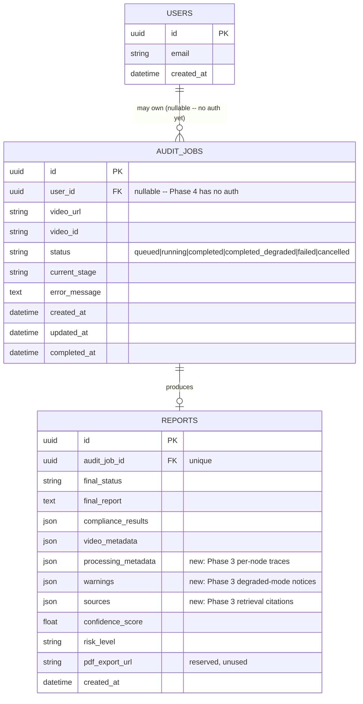

# PHASE_4_SUMMARY.md
## VidAuditFlow — Persistence & Background Audit Execution (Implementation Phase 3)

**Scope:** database layer, repositories, background job execution, and the new job-based API, per DATABASE_PLAN.md / API_PLAN.md / BACKEND_VISION.md. The LangGraph pipeline itself (`graph/workflow.py`, every node, every prompt) is **byte-for-byte unchanged** from Phase 3 — this phase adds persistence and async execution entirely from the outside, by observing the compiled graph's own event stream. No auth, no frontend, no queues/Redis/Celery, no PDF/chat/streaming.

---

## Architecture Changes

### Before (Phase 3)
```
Client -> POST /audit -> await graph.ainvoke() -> AuditResponse
                          (blocks the request for the full run; nothing persisted)
```

### After (Phase 4)
```
Client -> POST /api/v1/audits -> create AuditJob (queued) -> 202 Accepted (returns immediately)
                                        |
                                        v
                          BackgroundTasks -> jobs.audit_runner.execute_audit_job
                                        |
                                        v
                          graph.astream_events() observes the UNCHANGED graph
                                        |
                          on_chain_start -> AuditJob.current_stage updated (live)
                          on_chain_end   -> partial state merged into accumulator
                                        |
                                        v
                          AuditJob marked completed/completed_degraded/failed
                          Report persisted with full AI output
                                        |
                                        v
Client -> GET /api/v1/audits/{id}  (poll status/current_stage)
Client -> GET /api/v1/reports/{id} (fetch full persisted report)
```

The original `POST /audit` endpoint still exists and returns the identical response shape as before — it now runs through the exact same `execute_audit_job` function, just awaited inline instead of backgrounded, so **every** audit (old endpoint or new) is persisted to history.

### The key design decision: `astream_events`, not a graph rewrite

The task required "every LangGraph node should update `current_stage`" while also requiring the graph to remain unchanged. Two streaming approaches were evaluated:

- `stream_mode="updates"` only yields a node's result *after* it finishes — using this alone would mean `current_stage` only updates retroactively, leaving a polling client staring at a stale label for the full multi-minute duration of `transcript_agent` (Azure Video Indexer's upload+poll wait).
- `astream_events(version="v2")` (verified empirically, see below) additionally emits `on_chain_start` the moment each node *begins* — this is what `jobs/audit_runner.py` actually uses, so `current_stage` flips to "Downloading Video & Extracting Transcript" the instant that node starts, not after it completes.

Both node-start labeling and final-state reconstruction come from the same single `astream_events()` pass — no second graph execution, no duplicate Azure/LLM calls. This was verified live (see Verification Summary) and confirmed empirically before writing any code:
- A standalone test proved `on_chain_start`/`on_chain_end` fire correctly for all 7 real nodes, including the two parallel branches (`transcript_agent`, `ocr_agent`), while a top-level `"LangGraph"` event and the `"route_after_join"` conditional-edge function also appear and are correctly filtered out (they're not in `_STAGE_LABELS`, so they're silently ignored).
- A mocked full-pipeline run confirmed `on_chain_end` payloads have the identical shape `stream_mode="updates"` produces, so the same reducer-aware merge logic from Phase 3's design reasoning applies unchanged.

---

## Database Schema

Three tables, exactly as DATABASE_PLAN.md specifies, with two documented, justified deviations (see `db/models.py`'s module docstring):



**Deviations from DATABASE_PLAN.md, both documented in `db/models.py`:**
1. `AuditJob.user_id` is **nullable**. DATABASE_PLAN.md assumed Supabase Auth already existed; this phase explicitly excludes authentication, so no job has an owner yet. The column/FK/index are in place for a future auth phase to start populating.
2. `Report` gained three JSON columns DATABASE_PLAN.md didn't anticipate — `processing_metadata`, `warnings`, `sources` — because Phase 3 (per-node tracing, degraded-mode warnings, retrieval citations) postdates DATABASE_PLAN.md. Per this phase's "do not lose any AI output" requirement, all of it is persisted. `pdf_export_url` is kept as a reserved, unused column for schema fidelity (PDF export is out of scope).

`AuditJobStatus` enum (`db/models.py`): `queued`, `running`, `completed`, `completed_degraded`, `failed`, `cancelled` (reserved, not yet settable by any code path — future-safe per the task's explicit request).

---

## Job Lifecycle

```
queued --(execute_audit_job starts)--> running --(astream_events observes the graph)--> {live current_stage updates}
                                                                                              |
                                                                        graph finishes -------+
                                                                              |
                                        job_status == "completed"          -> completed
                                        job_status == "completed_degraded" -> completed_degraded
                                        job_status == "failed" (no transcript)  -> failed
                                        unexpected exception (rare; caught)     -> failed
```

A job can **never** be left stuck in `running`: the `try/except` around the entire `astream_events` loop in `jobs/audit_runner.py` guarantees `mark_failed()` runs on any unexpected exception, and the normal path always reaches `mark_terminal()` after the loop exits. Both were exercised directly (see Verification Summary).

`current_stage` values observed live during a real run: `"Starting Audit"` → `"Downloading Video & Extracting Transcript"` → `"Extracting OCR"` → `"Validating Results"` → `"Retrieving Policies"` → `"Compliance Analysis"` → `"Generating Summary"` → `"Completed"`/`"Failed"` (the last two set by `AuditRepository.mark_terminal`, not by a graph event).

---

## Files Changed

### New — database layer
| File | Purpose |
|---|---|
| `backend/src/db/base.py` | `new_uuid()`/`utcnow()` shared factories |
| `backend/src/db/models.py` | `User`, `AuditJob`, `AuditJobStatus`, `Report` SQLModel tables |
| `backend/src/db/session.py` | Async engine, `AsyncSessionFactory`, `get_session()` FastAPI dependency |
| `backend/src/db/migrations.py` | Programmatic `alembic upgrade head` runner, local-dev startup only |
| `alembic.ini`, `backend/alembic/env.py`, `backend/alembic/versions/9b37652115ab_initial_schema.py` | Alembic scaffold (async template) + the autogenerated initial migration |

### New — repository layer
| File | Purpose |
|---|---|
| `backend/src/repositories/user_repository.py` | `UserRepository` — thin CRUD, unused by any caller yet (no auth) |
| `backend/src/repositories/audit_repository.py` | `AuditRepository` — create/get/list + status-transition methods |
| `backend/src/repositories/report_repository.py` | `ReportRepository` — `create_for_job` (state → row), `get`, `get_by_job_id` |

### New — job execution & API
| File | Purpose |
|---|---|
| `backend/src/jobs/audit_runner.py` | `execute_audit_job` — the `astream_events`-based bridge described above |
| `backend/src/schemas/jobs.py` | `AuditJobCreate`, `AuditJobRead`, `ReportSummary`, `ReportRead` — strongly typed, reusing `ComplianceIssue`/`RetrievedRule`/`StageTrace` (no untyped dicts) |
| `backend/src/api/deps.py` | Re-exports `get_session` for routers |
| `backend/src/api/routers/audits.py` | `POST/GET /api/v1/audits`, `GET /api/v1/audits/{id}` |
| `backend/src/api/routers/reports.py` | `GET /api/v1/reports/{id}` |

### Modified
| File | Change |
|---|---|
| `backend/src/core/config.py` | Added `database_url` (defaults to local SQLite, per section 11's "SQLite should work automatically") |
| `backend/src/core/exceptions.py` | Added `NotFoundError` |
| `backend/src/api/main.py` | `lifespan` startup hook (auto-migrate in `local`), mounted the two new routers, `NotFoundError` → 404 handler, `/audit` now delegates to `execute_audit_job` instead of calling the graph directly |
| `pyproject.toml` | Added `sqlmodel`, `alembic`, `aiosqlite`, `asyncpg` (see Migration Notes) |
| `.gitignore` | Ignore local `*.db`/`*.db-journal` files |
| `.env.example` | Documented `DATABASE_URL` |

### Explicitly unchanged
- `graph/workflow.py`, `graph/supervisor.py`, every file in `graph/nodes/`, `graph/prompts.py` — zero modifications.
- Root `main.py` (CLI) — zero modifications; it still calls `graph.workflow.app.ainvoke()` directly and has no knowledge of the database.

---

## Migration Notes

- Run `uv sync` after pulling — new dependencies: `sqlmodel`, `alembic`, `aiosqlite` (async SQLite, dev), `asyncpg` (async Postgres, prod). `psycopg2-binary` (the old *sync* Postgres driver, removed in Phase 2) was deliberately **not** re-added — the backend is async end-to-end, so `asyncpg` is the correct equivalent, not a sync driver.
- **Local dev:** nothing to do. `DATABASE_URL` defaults to `sqlite+aiosqlite:///./vidauditflow.db`, and the API's startup hook runs `alembic upgrade head` automatically whenever `ENVIRONMENT=local` (the default). Verified live: starting the API with no existing `vidauditflow.db` file creates it and runs the migration automatically before the app starts serving traffic.
- **Production:** set `DATABASE_URL=postgresql+asyncpg://...` and run `alembic upgrade head` as an explicit deploy step — the startup hook only auto-migrates when `ENVIRONMENT=local`, matching DATABASE_PLAN.md's stated policy of never auto-running migrations against production on every boot.
- The initial migration (`9b37652115ab_initial_schema.py`) was generated via `alembic revision --autogenerate` against the live `SQLModel.metadata`, not hand-written, so it's guaranteed to match `db/models.py` exactly. One manual fix was required: the autogenerated file used `sqlmodel.sql.sqltypes.AutoString()` without importing `sqlmodel` — a minor, common Alembic-autogenerate gap, fixed by adding the import.
- Full downgrade → upgrade cycle (`alembic downgrade base` then `alembic upgrade head`) was verified to work cleanly.

---

## Performance Impact

- **The API no longer blocks on an audit.** `POST /api/v1/audits` returns in milliseconds regardless of how long the underlying Video Indexer processing takes; verified live — `/health` responded in 67-74ms while a real audit was mid-download in the background, consistent with Phase 1/2/3's non-blocking-event-loop checks.
- **No duplicate Azure work introduced by the new observation layer.** `astream_events()` observes the graph's existing execution; it does not re-invoke it. The Phase 3 single-flight coordinator (`graph/coordination.py`) is untouched and still verified to prevent a duplicate Video Indexer fetch between `transcript_agent` and `ocr_agent` — confirmed live (exactly one `[download] Destination: ...` line and one temp directory per job, cleaned up afterward, across every test run in this phase).
- **Each node completion now triggers 1-2 additional DB writes** (a stage update on start, a state-merge on end — the merge itself is in-memory, only the stage update touches the DB). For a ~7-node graph this is on the order of 7-10 small, indexed single-row `UPDATE`s per job — negligible next to the multi-second-to-multi-minute Azure/LLM calls themselves.
- **SQLite is sufficient for local dev and light concurrent load**; `aiosqlite` avoids blocking the event loop on disk I/O the way a synchronous SQLite driver would have.

---

## Remaining Technical Debt

- **`current_stage` granularity is capped by node granularity.** `transcript_agent` performs download + upload + poll + extraction as one atomic unit (by design, since OCR shares its result — see Phase 3). A polling client sees `"Downloading Video & Extracting Transcript"` for the entire multi-minute duration of that node, not fine-grained sub-steps ("now downloading", "now uploading", "now waiting on Azure"). Achieving finer granularity would require the node itself to emit intermediate progress, which this phase's "existing LangGraph pipeline unchanged" constraint explicitly rules out. Documented as a conscious trade-off, not an oversight.
- **No idempotency check on `POST /api/v1/audits`.** BACKEND_VISION.md suggests returning an existing `queued`/`running` job for a duplicate `video_url` instead of creating a new one; this phase's task list didn't call it out explicitly and it was left out to stay scoped. A double-click today creates two independent jobs (and, since there's no per-user concurrency cap either, two independent Video Indexer runs).
- **No rate limiting / per-user quota**, consistent with "no auth this phase" — there's no user to scope a quota to yet.
- **`UserRepository` has no caller.** The `User` table and repository exist per DATABASE_PLAN.md's schema and this phase's explicit "implement exactly three models" instruction, but nothing in the current request flow creates or reads a `User` row — `AuditJob.user_id` is always `None` today. This is intentional groundwork for a future auth phase, not a bug.
- **`AuditJobStatus.CANCELLED` is unreachable.** The enum value exists (future-safe, per the task's explicit request) but no endpoint or code path can currently set it — there is no cancel API yet.
- **Deprecated `langchain_community.vectorstores.AzureSearch`** (TECHNICAL_DEBT.md TD-16) is still in use inside `retrieval_agent` — unrelated to this phase's scope, unchanged.
- **No automated test suite** (unchanged from every prior phase's own known limitation). Verification here was manual/live end-to-end: real server boot, real HTTP calls, direct SQLite inspection, and a server restart to confirm persistence — see Verification Summary.
- **Log-buffering artifact during manual verification** (not a code defect): redirecting a long-running backgrounded Python process's stdout to a file without forcing unbuffered mode delays when structured JSON log lines actually appear on disk. This only affected how quickly *this session's own manual testing* could see log output in a file — it does not affect the application at all (Uvicorn's own reload/production run modes, and any real log aggregator reading the process's stdout directly rather than tailing a redirected file mid-write, are unaffected). Worth remembering for future manual verification sessions.

---

## Verification Summary

| Item | Result |
|---|---|
| Database initializes | ✅ Fresh `vidauditflow.db` created automatically on API startup with no manual steps |
| Alembic migration works | ✅ Autogenerated from live `SQLModel.metadata`, applied cleanly; full downgrade→upgrade cycle verified |
| POST creates job | ✅ `POST /api/v1/audits` → `202`, `status: "queued"`, row confirmed in SQLite directly |
| Background task executes | ✅ Job transitions `queued → running → failed/completed` without any further client action |
| Job status updates correctly | ✅ Live `current_stage` observed mid-run (`"Downloading Video & Extracting Transcript"` while a real download was in progress) |
| Report persists | ✅ `GET /api/v1/reports/{id}` returned full AI output — summary, score, risk level, violations, warnings, sources, per-node processing traces |
| API retrieves reports | ✅ `GET /api/v1/audits/{id}` → `report_id`; `GET /api/v1/reports/{id}` → full `ReportRead` |
| Existing LangGraph works | ✅ Zero files under `graph/` modified; mocked and live runs both produced identical node behavior to Phase 3 |
| CLI still works | ✅ `uv run python main.py` unchanged, unaffected by the database layer entirely |
| Existing API preserved | ✅ `POST /audit` response shape byte-identical to Phase 3; now also persists to history |
| Restarting the API preserves completed reports | ✅ Stopped and restarted the server; `GET /api/v1/audits` returned both previously created jobs with their `report_id`s intact |
| Repository pattern | ✅ `UserRepository`/`AuditRepository`/`ReportRepository`, no business logic beyond CRUD + simple status transitions |
| Typed responses | ✅ `AuditJobRead`/`ReportRead`/`ReportSummary` — no raw dicts; `compliance_results`/`sources`/`processing_metadata` reuse the graph's own typed models |
| Non-blocking / concurrency | ✅ `/health` responded in ~70ms while a real audit ran in the background |
